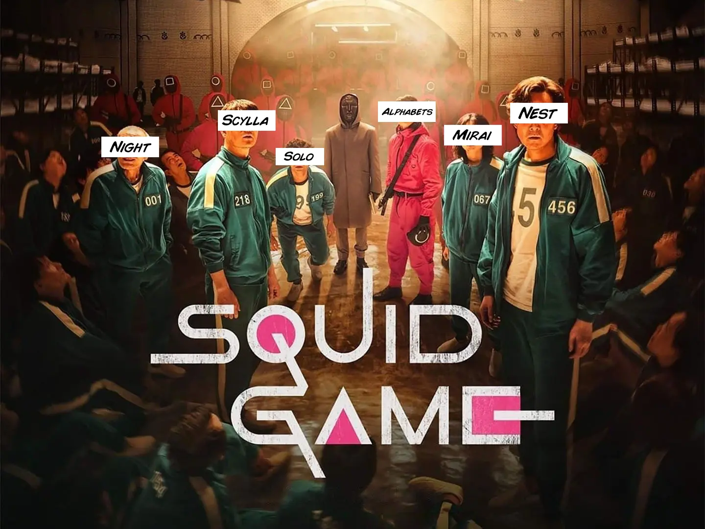

# Die Ideen
Warum sollte ich über ein neues Projekt nachdenken, wenn ich schon mehrere halbfertig habe? Lasst mich die Kandidaten vorstellen... (es wird besser, wenn ihr es mit epischer Hintergrundmusik lest →)[^100]

[^100]:
    {-} <audio controls>
    <source src="../../files/final/defend.m4a" type="audio/mp4">
    Dein Browser unterstützt das Audioelement nicht.
    </audio>\

## Alphabets 
[^101] Alphabets ist ein modulares mechanisches Display zur Anzeige interaktiver Nachrichten. Ein Projekt, das ich 2014 begonnen und seither mehrfach wieder aufgegriffen und zur Seite gelegt habe. Kommerziell gesehen ist es ein gutes Produkt. Es war so erfolgreich, dass manche Leute mich baten, ihnen 800 bis 1000 Einheiten zu senden.

[^101]:
  {-} [→ *Repository*](https://github.com/TheBeachLab/alphabets)

## Night
[comment1]: <> (Anmerkung für den Übersetzer: 'Night' ist ein Eigenname und sollte nicht übersetzt werden)
[^102]  *Day & Night* sind die Namen zweier[^103] automatisierter Dobson-Newton-Reflektorteleskope für die Verfolgung von Himmelskörpern, die Erfassung und Stapelung von Bildern. Sie sind identisch, außer dass einer weiß und der andere schwarz ist. Licht und Dunkelheit, Tag und Nacht. 

[^102]:
  {-} [→ *Repository*](https://github.com/TheBeachLab/day-and-night)
[^103]: 
    Warum zwei? Ein weiteres der vielen gebrochenen Versprechen.

## Solo
[comment2]: <> (Anmerkung für den Übersetzer: 'Solo' ist ein Eigenname und sollte nicht übersetzt werden)
[^104] *Solo* ist der Name eines Zubehörs für SLR-Kameras, das die Aufnahme von persönlichen Videos durch Automatisierung der Fokussierung und einiger Kamerabewegungen erleichtert. Das einzige, was zwischen Erfolg und mir steht, ist meine Faulheit.

[^104]:
  {-} [→ *Repository*](https://github.com/TheBeachLab/solo)

## Mirai 未来
[^105] Mirai ist ein tragbarer Mikrocomputer im *Retro-Cyberdeck*-Stil mit mechanischer Tastatur. Er zielt darauf ab, die Nostalgie für analoge Geräte und das Design der 80er Jahre durch digitale Fertigung wiederzubeleben. Die Vorstellung eines modularen Computers hat mich immer angezogen. Warum müssen wir den ganzen Computer ersetzen, wenn wir nur einen neuen Prozessor oder mehr Speicher wollen?

[^105]:
  {-} [→ *Repository*](https://github.com/TheBeachLab/mirai)

## Scylla Σκύλλα
 [^106] Scylla *ist*[^107] ein Hydrofoil mit Turbine, entworfen für Freizeitaktivitäten in Meeren oder Seen. Nach der katastrophalen zweiten Woche hat dieses Projekt einen ernsten Ausblick mit negativer Perspektive.

 

[^106]:
  {-} [→ *Repository*](https://github.com/TheBeachLab/scylla)
[^107]: Scylla *war* eine Kreatur der griechischen Mythologie, die Schiffe in der Straße von Messina plagte.

## Nest 
 [^108] Nest ist kein Wohnhaus, aber man kann darin leben. Es ist ein Lebenserhaltungsmodul für den temporären Gebrauch, portabel und für den Einzelpersonenmarkt gedacht[^109]. Ich habe an diesem Projekt theoretisch während meines Aufenthaltes am MIT Entrepreneurship Bootcamp gearbeitet und es erhielt sehr positive Rückmeldungen. Ich würde es gerne wieder aufgreifen und einen Prototyp bauen, auch wenn er nicht voll funktionsfähig ist (ich denke, das ist ein Projekt, das man in der Gruppe angehen sollte).

[^108]:
  {-} [→ *Repository*](https://github.com/TheBeachLab/nest)

[^109]:
    Gelegentlich zwei `;-)`

# Die Entscheidung

## Vergleichstabelle
<figure class="full-width">
|                   |         Nest        | Mirai | Scylla | Alphabets | Solo   |         Night |
|-------------------|:-----------------------:|:-----:|:------:|:---------:|:------:|:-------------:|
| Wochen$^\dagger$  |            16           |   4   |    8   |     4     |    2   |       6       |
| Schwierigkeitsgrad| 4/5$^\dagger$$^\dagger$ |  2/5  |   4/5  |    2/5    |   2/5  |      3/5      |
| Vielseitigkeit    |           5/5           |  1/5  |   1/5  |    4/5    |   2/5  |      2/5      |
| Kosten            |            1k          |  0.5k |   1k   |    0.1k   |  0.1k  |      0.5k     |
| Portabilität      |           Gering       |  Hoch |  Mittel|    Hoch   |  Hoch  |     Mittel    |
<figcaption>
$^\dagger$ Geschätzte Arbeitswochen um es abzuschließen\
$^\dagger$$^\dagger$ Könnte aufgrund von sanitären Installationen auf 5/5 steigen
</figcaption>
</figure>

## ~~Ikigai~~ Venn-Diagramm

<figure>
^[{-} Die 6 Projekte, gezeichnet auf meinem "Venn-Diagramm". Das ist kein Ikigai (生き甲斐). Das Projekt Mirai ist zu persönlich, ich glaube nicht, dass es Marktpotential hat. Nur Nest bietet der Gesellschaft einen klaren Nutzen.]

</figure>

## Das Urteil
Eigentlich sollte ich mich jetzt für eines entscheiden. Aber das werde ich nicht. Stattdessen werde ich mit allen Projekten, die ich am Laufen habe, voranschreiten. Um sie gleichzeitig zu managen, werde ich mich in kleinen Spiralen bewegen. Einige werden auf der Strecke bleiben und nur eines wird sich als endgültiges Projekt durchsetzen. 

Jedes Projekt ist in seinem eigenen Repository untergebracht. Diese Seite wird den Fortschritt jedes einzelnen von ihnen wie ein Tagebuch verfolgen.

