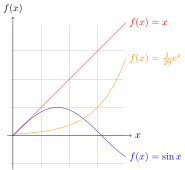

:::{.note .yellow}
|     |
| --- |
| *Task:* |
| Model (raster, vector, 2D, 3D, rendering, animation, simulation, ...) a possible final project, compress your images and videos, and publish a description with your design files on your page.  |
:::

# Week's Goals

[Last week started off on the wrong foot]{.smallcaps}. I barely had time to do anything.[^101] This week I'm going to be more disciplined. The first thing I'm doing is defining my goals and setting a deadline to achieve them. It's one of my favorite weeks because **I love trying out new software**. In order of preference, I'm planning to:

[^101]: I forgot that I never follow my own advice.

- **OpenFOAM. 1 day of dedication**
  - I want to learn how to create geometries in Blender.
  - I want to run a simulation of an airfoil.
  - I want to simulate incompressible flow.
  - I want to learn how to visualize results in Paraview.
- **FreeCAD. 1 day of dedication**. I have a love-hate relationship with FreeCAD. I use it, I hate it, then I miss it, I use it again, and then I hate it again. Let's see if I can fall in love with [Ondsel](https://ondsel.com) this time. Specifically, here's what I'd like to do this week:
  - Give all the tools another try to see if they’ve improved.
  - Test out the Assembly Workbench.
  - Try the TechDraw Workbench.
  - Run a simulation in Calculix.
  - I hope to integrate some hardware device to control parameters.
  - I aim to install and test the add-on by [Pieter Hijma](https://pieterhijma.net/index.html) `OSH Automated Documentation`.
- **Blender. 2 days of dedication.** This is where I've got my work cut out for me.
  - Learn as much as I can about Geometry Nodes.
  - Real-time rendering with EEVEE.
  - Control a virtual camera with my phone.
  - Create a physics simulation.
  - Create an animation with Grease Pencil.
  - Explore Blender's serial port interface.
- **JavaScript. 1 day of dedication**
  - I want to use ThreeJS to visualize 3D models on the web page.
  - I want to learn more about D3JS for data visualizations and mapping.
- **Artificial Intelligence. 1 day of dedication**
  - Explore the status of generative models in 3D
  - Read the paper on generating 3D models from large language models (LLM).
  - Use Midjourney or something similar to generate some images for the final project.
- **Command line. 1/2 day of dedication**
  - I will integrate Imagemagick into the documentation generation scripts to automate image compression.
  - I will also integrate ffmpeg into the scripts for video compression.
- **Audio. 1/2 day of dedication**
  - I'm going to take some time to learn a bit about Sonic Pi.

I think I may have overdone it. If I manage to do 1/4 of this, I'll be more than happy.

# OpenFOAM

[The Navier-Stokes equation]{.smallcaps} is a set of partial differential equations that describe fluid motion. In vector form and in a three-dimensional coordinate system, the Navier-Stokes equations for an incompressible fluid are:

\[
\rho \left( \frac{\partial \mathbf{v}}{\partial t} + (\mathbf{v} \cdot \nabla)\mathbf{v} \right) = -\nabla p + \mu \nabla^2 \mathbf{v} + \rho \mathbf{g}
\]

where:

- \(\rho\) is fluid density,
- \(\mathbf{v}\) is the fluid velocity vector,
- \(t\) is time,
- \(p\) is pressure,
- \(\mu\) is the fluid's dynamic viscosity,
- \(\nabla\) is the nabla operator,
- \(\nabla^2\) is the Laplacian,
- \(\mathbf{g}\) is the vector of acceleration due to gravity.

This equation describes the conservation of momentum and the relationship between pressure, viscosity, and fluid acceleration. Solving these equations can be complex, especially in nonlinear or turbulent situations. If the fluid is compressible, things get a bit more complicated because \(\rho\) is not constant but can vary in time and space.

\[
\frac{\partial \rho}{\partial t} + \nabla \cdot (\rho \mathbf{v}) = 0
\]

These equations cannot be solved analytically; numerical methods must be used. That's where [OpenFOAM](https://openfoam.org)[^201], an open-source suite for numerical fluid simulations, comes in. OpenFOAM doesn't have a graphical interface. All files, including the geometry, initial conditions, boundary conditions, model, etc., are introduced via text files[^203].

[^201]: Open Source Field Operation and Manipulation

[^203]: If you use a graphical interface, you'll soon be unemployed. Why do you think so much is invested in training language models?

## Wing Profile Simulation
[*under development*]{.mark .yellow}

I fly on an *ICP Savannah S* airplane with a modified NACA-65018[^211] wing profile. It's not very fast, but it can take off and land on very short distances and fly at very low speeds without stalling[^212]. Near the leading edge of the wing, there are some plastic parts called vortex generators. Their role is to create micro-turbulences to prevent the boundary layer from detaching from the wing. The goal in OpenFOAM is to simulate a section of the wing with and without vortex generators and verify the difference.


[^212]: A condition that occurs when the wing loses lift by exceeding the critical angle of attack.

[^211]: The numbers are parameters that can be input into equations to generate the cross-sectional shape and calculate its properties.

## Incompressible Fluid
[*under development*]{.mark .yellow}

# Ondsel
[*under development*]{.mark .yellow}

# Blender
[*under development*]{.mark .yellow}

# Javascript
[*under development*]{.mark .yellow}

# Artificial Intelligence

[We've made progress, but we still have a long way to go]{.smallcaps}. Today, February 5, 2024, I asked the 4 most well-known artificial intelligences (ChatGPT 3.5, ChatGPT4 Turbo, Bing, and Bard) to do something very simple:

[^601] <center>*Draw an Ikigai diagram in TikZ*</center>
I have two observations and one conclusion: The first observation is that **none** of the 4 intelligences did a good job. The second observation, also interesting, is that **it is indistinguishable** which one is especially better than the others. Despite some models being technically superior to others. The conclusion, therefore, is that it seems clear that the "artificial" intelligences have **little to no reasoning ability** in areas where they have not been trained. Even knowing the rules for creating the diagram, they were incapable of drawing 4 circles and a few labels.

<figure>
^[{-} Who's who? Name which AI made each of these diagrams. Solution at the bottom of the page.]

</figure>

[^601]: 
    {-} I explain what TikZ is further down

Interestingly, Bard (Gemini Pro model) couldn't even generate correct code. I had to pass Bard's code to Bing to have it corrected. Supposedly Bing is ChatGPT4, but I think that copy came out blurry. These models need a large amount of training data to recognize patterns; they do not reason in the human sense. I could have spent the entire afternoon trying to get the models to move the circles to their correct positions. There are people who do that, but I find it absurd. There's a huge effort to achieve General AI capable of reasoning like a human. However, for now, we'll have to continue training the models in the areas we want. That's one of my goals at Fab Academy.

# Images
[*in development*]{.mark .yellow}


## Imagemagick

It's good for a ton of stuff. You can add a watermark to an image.\
Or combine two or more images horizontally so that:\
a) They have the same height\
b) The images are separated by a transparent space

[^761]
```{.sh .numberLines .tight-code}
montage savannah.jpg naca65018.png -geometry +5+0 -tile 2x1\ 
  -resize x800 -background none -gravity West -extent x800 airplane.webp
```

[^761]: {-} The composite photograph of the airplane and the airfoil profile was made like this.

## PGF/TikZ
I used to use [TikZ](https://tikz.dev) in college to make graphics.\
As you can see, I’m using anything that generates through code.

[^760]
```{.tex .numberLines .tight-code}
% Filename: tikz01.tex
% Usage: latex tikz01.tex --> tikz01.dvi
%        dvisvgm --font-format=woff tikz01.dvi --> tikz01.svg
\documentclass[tikz]{standalone}
\begin{document}
\begin{tikzpicture}[domain=0:4]
  \draw[very thin,color=gray] (-0.1,-1.1) grid (3.9,3.9);
  \draw[->] (-0.2,0) -- (4.2,0) node[right] {$x$};
  \draw[->] (0,-1.2) -- (0,4.2) node[above] {$f(x)$};
  \draw[color=red]    plot (\x,\x)             node[right] {$f(x) =x$};
  % \x r means to convert '\x' from degrees to _r_adians:
  \draw[color=blue]   plot (\x,{sin(\x r)})    node[right] {$f(x) = \sin x$};
  \draw[color=orange] plot (\x,{0.05*exp(\x)}) node[right] {$f(x) = \frac{1}{20} \mathrm e^x$};
\end{tikzpicture}
\end{document}
```

[^760]:
  {-} 
  [→ *Source code*](../../files/w02/tikz/tikz01.tex)


# Audio and video
[*under development*]{.mark .yellow}

## ffmpeg

Incredibly useful for a myriad of operations. It used to be hard to memorize the commands, but now you can just ask a language model.

## yt-dlp

I use this terminal utility to download videos from Fab Academy hosted on [Youtube]() or [Vimeo](https://vimeo.com/academany/videos). For example:

```{.bash .numberLines .tight-code}
yt-dlp --write-sub --all-subs [Video URL]
```

## Manim

You've likely seen a video by [3blue1brown](https://www.youtube.com/@3blue1brown).\
[Manim] is the Python library he created to generate his animations.\
Here's my *hello world!*: `manim -pqh hello_manim.py AnimatedSquareToCircle`

[^802]
```{.python .numberLines .tight-code}
from manim import *
class AnimatedSquareToCircle(Scene):
    def construct(self):
        circle = Circle()  # create a circle
        square = Square()  # create a square

        self.play(Create(square))  # show the square on screen
        self.play(square.animate.rotate(PI / 4))  # rotate the square
        self.play(
            ReplacementTransform(square, circle)
        )  # transform the square into a circle
        self.play(
            circle.animate.set_fill(BLUE, opacity=0.2)
        )  # color the circle on screen
```

[^802]:
    {-} <video nocontrols autoplay loop muted style="max-width: 100%; height: auto;">
    <source src="../../files/w02/manim/media/videos/hello_manim/1080p60/AnimatedSquareToCircle.mp4" type="video/mp4">
    Your browser does not support the video element.
    </video>\
    [→ *Source code*](../../files/w02/manim/hello_manim.py)

## Sonic Pi
I'm putting together a session using some audio samples from Fab Academy.\
I can't share more just yet.

[^801]
```{.ruby .numberLines .tight-code}
use_bpm 130

live_loop :met1 do # this is a metronome to sync the beats
  sleep 1
end

define :pattern do |pattern|
  pattern.ring.tick == "x"
end

live_loop :kick, sync: :met1 do
  a = 2
  sample :bd_haus, amp: a, release: 8, cutoff: 110 if pattern("x-----x---x--x--")
  sleep 0.25
end

live_loop :clap, sync: :met1 do
  sleep 1
  sample :perc_snap, amp: 1
  sleep 1
end

live_loop :hhc1, sync: :met1 do
  sample :drum_cymbal_closed, amp: 0.5 if pattern("x-x-x-x-xxx-x-x-")
  sleep 0.125
end
```

[^801]:
    {-} <audio controls>
    <source src="../../files/w02/sonicpi/neil_rave.m4a" type="audio/mp4">
    Your browser does not support the audio element.
    </audio>\
    [→ *Source code*](../../files/w02/sonicpi/neil_rave.rb)

# Conclusions
[*under development*]{.mark .yellow}

[Participants of Fab Academy are heroes]{.smallcaps}[^901]. I had completely forgotten how tough the course is. I admit it's been a challenge for me. It's Sunday, and I've accomplished less than 5% of what I had planned. Moreover, I keep making changes to the template, and when I fix one thing, I break another.

[^901]: Instructors are heroes too. Especially those from [Puebla](https://fabacademy.org/2024/labs/puebla/).

I'm glad to be participating again as a student. I still smile from the back row when you're called to the board, but not as much. I'm more human. This experience will improve my social skills as an instructor[^902].

I'm particularly proud of putting into practice engineering skills I thought I had forgotten. Fab Academy has been the motivation I needed. I believe that combining these competencies with the power of AI, amazing results can be achieved.

[^902]: I have a somewhat peculiar educational style. You could say I'm more like [Homelander](https://en.wikipedia.org/wiki/Homelander) than Superman.

*Answer to the artificial intelligence section question: From left to right: GPT3.5, GPT4, Bing, and Bard. Did you guess it?*

