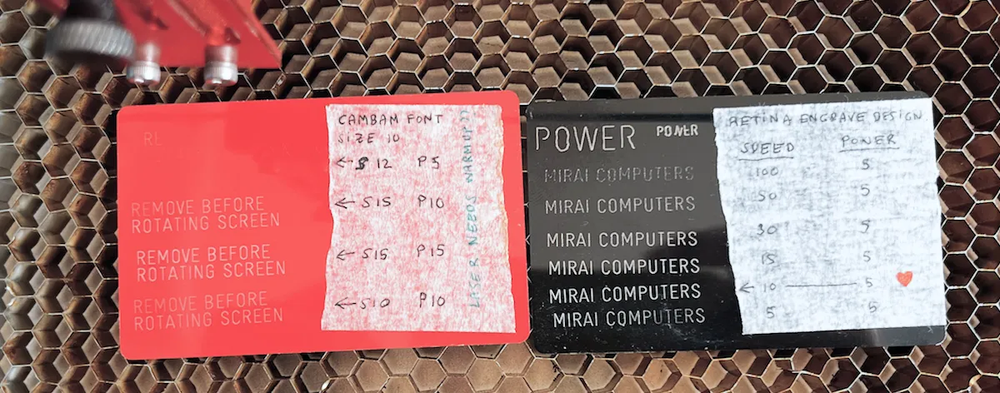

:::{.note .yellow}
|     |
| --- |
| 1) Characterize your laser cutter (focus, power, speed, etc.) |
| 2) Cut something on the vinyl cutter. |
| 3) Design, laser cut, and document a parametric construction kit,\
- considering the *kerf* of the laser cutter,\
- that can be assembled in various ways,\
- and, for extra credit, include non-flat elements.|
:::

# Characterize... the laser cutter?
[I'd love to get my hands on Neil's laser cutter]{.smallcaps}. **My laser cutter doesn't stick to a fixed kerf**. The *power* and *cutting speed* influence the kerf, the *material* impacts the kerf, the *thickness* of the material plays a role in the kerf, even the *color*[^101] of the material messes with the kerf. I have to follow a process to characterize each material with the laser. Even though I usually don't showcase it in the documentation, I go through this process every time I tweak any material parameter. It's a hassle, I know. But skipping these minutes can cost you hours of setbacks and frustration later on or even ruin all your hard work. Here's my free advice of the week:

*spend those minutes wisely*

The first thing I do is hunt down the optimal cutting or marking parameters. I grab a sample[^100] of the material I want to characterize. Pop it on the platform and make sure the focus is spot-on. The goal is to find *the lowest possible energy*[^102] that cuts the material without warping or toasting it. I create a pattern in Inkscape with copies in different colors and assign a setting to each line. As a starting point, you can use settings for a material and a machine similar to yours. Some machines come with a library of materials and default cutting settings. I usually kick off at +5% from the known setting and drop 5% on each line. The key is to jot down those settings on the same material and save them for future reference. These settings come in handy every time I want to cut or mark the material.

[^100]:
    5x5 cm is sufficient
[^101]:
    Dark colors absorb more radiation and are easier to cut
[^102]:
    It's a combo of power, speed, number of passes, and frequency, if it has one. My laser (Full Spectrum 5th gen) doesn't have frequency control. Whenever possible, I aim for maximum speed. If it's a heat-sensitive material (like corrugated polypropylene), I make multiple passes at low power.

Only then do I move on to measure the kerf. But remember, if you change any parameter, that kerf is no longer valid.

# Cutting "something" on the vinyl cutter
[The vinyl cutter is my preferred machine]{.smallcaps}. It's versatile, fast, clean, emits no smoke or vapors, and requires no chemicals.

<figure>
^[{-} Some stickers I've cut with the vinyl cutter. From left to right, Snow Lion (8 layers), The Empty Man (5 layers), Beach Lab (2 layers), and Kali (5 layers)]

</figure>

In the latest review, Neil mentioned wanting to see designs *for the final project*.\
→ not whatever you feel like\
→ not something random\
→ for the final project

Following that philosophy, I'm going to cut the logos of my projects. There are two reasons why all my projects have a name/brand.

1. The first reason is that I intend to commercialize them. In a few weeks, there's a class called *Invention, Intellectual Property, and Income*. Throughout many years following Fab Academy, I hear people completely ignoring that week, saying they "aren't motivated by commercial interest," they do it "for the love of art," "for the good of humanity." How lovely. Dear friends: As far as I know, you can't pay taxes with your final project, nor with courses for your community, nor with aquaponics lettuces. They only accept money.
2. The second reason I give a short name is that cutting is easy; the machine does it. But weeding the figure from the background with tweezers is torture, especially if the sticker is this:

*modular mono-digit split-flap open-source mechanical panel*

*to be continued...*

