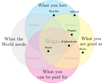
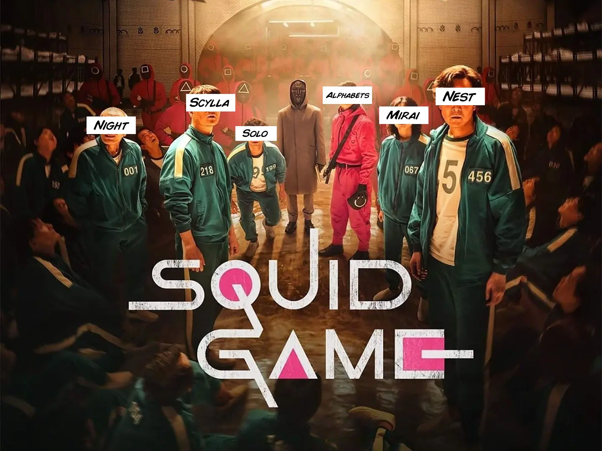

# Las ideas

## Alphabets
Alphabets es una pantalla mecánica modular para mostrar mensajes interactivos. Es un proyecto que empecé en 2014 y he abandonado y retomado en múltiples ocasiones.

## Day & Night
Day & Night son dos[^101] telescopios reflectores Dobson Newtonianos automatizados para seguir cuerpos celestes, capturar y apilar imágenes. Son idénticos, excepto que uno es blanco y el otro negro. Luz y oscuridad, día y noche.

[^101]: ¿Por qué dos? Otra de tantas promesas incumplidas que hago.

## Slider
Slide

## Mirai 未来
Mirai es un microordenador portátil de estética *retro cyberdeck* que incorpora un teclado mecánico. Aspira a revivir la nostalgia de los dispositivos analógicos y el diseño de los años 80 mediante la fabricación digital.

## Scylla Σκύλλα
 Scylla *es*[^102] una hidroala con turbina diseñada para actividades recreativas en mares o lagos.

 

[^102]: Scylla *era* una criatura de la mitología griega que atormentaba a los buques en el estrecho de Messina.

## N.E.S.T.
 N.E.S.T. no es una vivienda, pero se puede vivir en ella. Es un módulo de soporte vital para uso temporal, portable y dirigido al mercado de una sola persona. Ocasionalmente dos ;-) 

# La decisión

## Cuadro comparativo
<figure>
|                   |         N.E.S.T.        | Mirai | Scylla | Alphabets | Slider | Day and Night |
|-------------------|:-----------------------:|:-----:|:------:|:---------:|:------:|:-------------:|
| Semanas$^\dagger$ |            16           |   4   |    8   |     4     |    2   |       4       |
| Dificultad        | 4/5$^\dagger$$^\dagger$ |  2/5  |   4/5  |    2/5    |   2/5  |      3/5      |
| Versatilidad      |           5/5           |  1/5  |   1/5  |    4/5    |   2/5  |      2/5      |
| Coste             |            1k           |  0.5k |   1k   |    0.1k   |  0.1k  |      0.5k     |
| Portabilidad      |           Baja          |  Alta |  Media |    Alta   |  Alta  |     Media     |<figcaption>
$^\dagger$ Semanas de trabajo estimadas para completarlo\
$^\dagger$$^\dagger$ Podría llegar a 5/5 por las instalaciones
</figcaption>
</figure>

## Ikigai

<figure>
^[{-} Ikigai.]

</figure>

## El veredicto
Se supone que ahora tengo que decidirme por uno. Pero no lo haré. En lugar de eso, avanzaré con todos los proyectos que tengo en marcha. Para manejarlos simultáneamente me moveré en espirales pequeñas. Algunos se quedarán en el camino y sólo uno se consolidará como proyecto final. 

