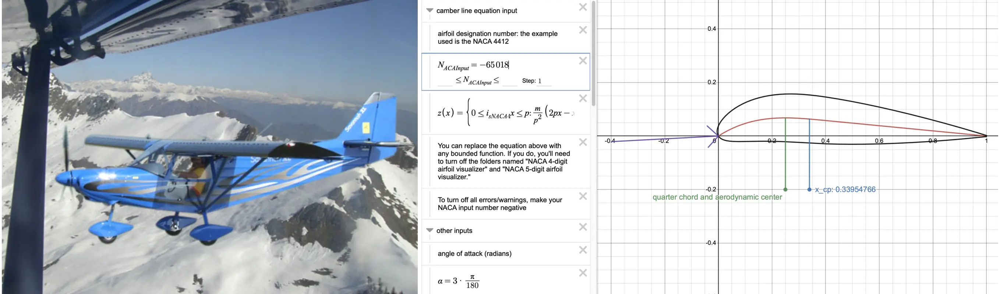

:::{.note .yellow}
|     |
| --- |
| *Tarea:* |
| modela (raster, vector, 2D, 3D, renderizado, animación, simulación, ..) un posible un proyecto final, comprime tus imágenes y videos, y publica una descripción con tus archivos de diseño en tu página.  |
:::

# Objetivos de la semana

[La semana pasada ya empecé mal]{.smallcaps}. No me dió tiempo a hacer casi nada.[^101] Esta semana voy a ser más disciplinado. Lo primero que voy a hacer es definir lo que quiero hacer y asignar una fecha límite para cumplirlo. Esta es una de mis semanas favoritas porque **me encanta probar software nuevo**. por orden de preferencia voy a hacer:

[^101]: Se me había olvidado que nunca sigo los consejos que doy.

- **OpenFOAM. 1 día de dedicación**
  - Quiero aprender a crear geometrías en Blender.
  - Quiero hacer una simulación de un perfil alar.
  - Quiero hacer una simulación de fluido incompresible.
  - Quiero aprender a visualizar resultados en Paraview
- **FreeCAD. 1 día de dedicación**. Tengo una relación de amor-odio con FreeCAD. Lo uso, lo odio, después lo echo de menos, lo vuelvo a usar, y otra vez lo odio. Voy a ver si logro enamorarme de [Ondsel](https://ondsel.com). En particular, estas son las cosas que me gustaría hacer esta semana:
  - Probar otra vez todas las herramientas, a ver si han mejorado.
  - Probar el Assembly Workbench.
  - Probar TechDraw Workbench.
  - Probar una simulación en Calculix.
  - Espero integrar algún dispositivo de hardware para controlar parámetros.
  - Espero poder instalar y probar el add-on de [Pieter Hijma](https://pieterhijma.net/index.html) `OSH Automated Documentation`.
- **Blender. 2 dias de dedicación.** Aquí tengo mucho trabajo. 
  - Aprender tanto como pueda de Geometry Nodes.
  - Renderizar en tiempo real con EEVEE.
  - Controlar una cámara virtual con el teléfono.
  - Crear una simulación física.
  - Crear una animación con Grease Pencil.
  - Explorar la interfaz del puerto de serie en Blender.
- **JavaScript. 1 día de dedicación**
  - Quiero usar ThreeJS para poder visualizar modelos 3D en la página web.
  - Quiero aprender más sobre D3JS para hacer visualizaciones de datos y cartografía. 
- **Inteligencia Artificial. 1 día de dedicación**
  - Explorar el estado de los modelos generativos en 3D
  - Leer el artículo sobre generación de modelos 3D a partir de grandes modelos de lenguaje (LLM).
  - Usar Midjourney o similar para generar algunas imágenes del proyecto final.
- **Línea de comandos. 1/2 día de dedicación**
  - Voy a integrar Imagemagick en los script de generación de documentación para que automatice la compresión de imágenes.
  - También voy a integrar ffmpeg en los script para comprimir video.
- **Audio. 1/2 día de dedicación**
  - Voy a tomarme un poco tiempo para aprender algo de Sonic Pi.

Creo que me he pasado. Si hago 1/4 parte ya puedo estar contento.

# OpenFOAM

[La ecuación de Navier-Stokes]{.smallcaps} es un conjunto de ecuaciones diferenciales parciales que describen el movimiento de los fluidos. En forma vectorial y en un sistema de coordenadas tridimensional, las ecuaciones de Navier-Stokes para un fluido incompresible son:

\[
\rho \left( \frac{\partial \mathbf{v}}{\partial t} + (\mathbf{v} \cdot \nabla)\mathbf{v} \right) = -\nabla p + \mu \nabla^2 \mathbf{v} + \rho \mathbf{g}
\]

donde:

- \(\rho\) es la densidad del fluido,
- \(\mathbf{v}\) es el vector de velocidad del fluido,
- \(t\) es el tiempo,
- \(p\) es la presión,
- \(\mu\) es la viscosidad dinámica del fluido,
- \(\nabla\) es el operador nabla,
- \(\nabla^2\) es el laplaciano,
- \(\mathbf{g}\) es el vector de la aceleración debida a la gravedad.

Esta ecuación describe la conservación de la cantidad de movimiento y la relación entre la presión, la viscosidad y la aceleración del fluido. Resolver estas ecuaciones puede ser complejo, especialmente en situaciones no lineales o turbulentas. Si el fluido es compresible, la cosa se complica un poco más porque \(\rho\) ya no es constante sino que puede variar en el tiempo y en el espacio.

\[
\frac{\partial \rho}{\partial t} + \nabla \cdot (\rho \mathbf{v}) = 0
\]

No se pueden resolver estas ecuaciones de forma analítica, se necesitan usar métodos numéricos. Ahí es donde interviene [OpenFOAM](https://openfoam.org)[^201], un conjunto de programas de código abierto para la simulación numérica de fluidos. OpenFOAM no tiene interfaz gráfica. Todos los archivos, incluyendo la geometría, condiciones iniciales, condiciones de contorno, modelo, etc. se introducen mediante archivos de texto[^203].

[^201]: Open Source Field Operation and Manipulation

[^203]: Si usas una interfaz gráfica pronto estarás en el paro. ¿Por qué crees que se invierte tanto en entrenar modelos de lenguaje?

## Simulación de un perfil alar
[*en desarrollo*]{.mark .yellow}

Vuelo en un avión *ICP Savannah S* con perfil de ala NACA-65018[^211] modificado. No es muy rápido, pero puede despegar y aterrizar en distancias muy cortas y volar a muy poca velocidad sin entrar en pérdida[^212]. Cerca del borde de ataque del ala, hay unas piezas de plástico llamadas generadores de vortex. Su función es generar micro-turbulencias para evitar que la capa límite se despegue del ala. El objetivo en OpenFOAM es simular una sección del ala con y sin generadores de vortex y comprobar la diferencia.



[^212]: Condición que se da cuando el ala pierde sustentación al superar el ángulo de ataque crítico.

[^211]: Los números son parámetros que se pueden introducir en ecuaciones para generar la sección transversal y calcular sus propiedades.

## Fluido incompresible
[*en desarrollo*]{.mark .yellow}

# Ondsel
[*en desarrollo*]{.mark .yellow}

# Blender
[*en desarrollo*]{.mark .yellow}

# Javascript
[*en desarrollo*]{.mark .yellow}

# Inteligencia artificial

[Hemos avanzado, pero aun nos queda bastante camino]{.smallcaps}. Hoy 5 de febrero de 2024 he preguntado a las 4 inteligencias artificiales más conocidas (ChatGPT 3.5, ChatGPT4 Turbo, Bing y Bard) que hagan algo muy sencillo:\

[^601] <center>*Dibuja un diagrama Ikigai en TikZ*</center>
Tengo dos observaciones y una conclusión: La primera observación es que **ninguna** de las 4 inteligencias ha hecho un buen trabajo. La segunda observación, también interesante, es que **no puede distinguirse** que una sea especialmente mejor que la otra. A pesar de que algunos modelos son técnicamente mejores que otros. La conclusión es pues, que parece claro que las "inteligencias" artificiales tienen **poca o nula capacidad de razonamiento** en areas donde no han sido entrenadas. Incluso conociendo las reglas de ejecución del diagrama, no han sido capaces de dibujar 4 círculos y unas pocas etiquetas.

<figure>
^[{-} ¿Quién es quién? Pon nombre a que IA ha hecho cada uno de estos diagramas. Solución al final de la página.]

</figure>

[^601]: 
    {-} Más abajo explico lo que es TikZ

Como curiosidad Bard (modelo Gemini Pro) ni siquiera fue capaz de generar código correcto. Tuve que pasar el código de Bard a Bing para que lo corrigiese. Supuestamente Bing es ChatGPT4, pero yo creo que la fotocopia salió borrosa. Estos modelos necesitan gran cantidad de datos de entrenamiento para reconocer patrones, no razonan en el sentido humano. Podría haber pasado toda la tarde intentando que los modelos muevan los círculos a su posición correcta. Hay gente que lo hace, pero me parece absurdo. Existe un gran esfuerzo para lograr una IAG que sea capaz de razonar como un humano. No obstante, por ahora habrá que seguir entrenando a los modelos en las áreas que deseemos. Ese es uno de mis objetivos en Fab Academy.

# Imágenes
[*en desarrollo*]{.mark .yellow}


## Imagemagick

Sirve para infinidad de cosas. Puedes añadir una marca de agua a una imagen.\
O combinar dos o más imágenes horizontalmente de modo que:\
a) Tengan la misma altura\
b) Las imágenes estén separadas por un espacio transparente

[^761]
```{.sh .numberLines .tight-code}
montage savannah.jpg naca65018.png -geometry +5+0 -tile 2x1\ 
  -resize x800 -background none -gravity West -extent x800 avion.webp
```

[^761]: {-} La fotografía compuesta del avión y el perfil alar se han hecho así.

## PGF/TikZ
Solía usar [TikZ](https://tikz.dev) en la universidad para hacer gráficos.\
Como veis, estoy usando cualquier cosa que use código para generarse.

[^760]
```{.tex .numberLines .tight-code}
% Filename: tikz01.tex
% Usage: latex tikz01.tex --> tikz01.dvi
%        dvisvgm --font-format=woff tikz01.dvi --> tikz01.svg
\documentclass[tikz]{standalone}
\begin{document}
\begin{tikzpicture}[domain=0:4]
  \draw[very thin,color=gray] (-0.1,-1.1) grid (3.9,3.9);
  \draw[->] (-0.2,0) -- (4.2,0) node[right] {$x$};
  \draw[->] (0,-1.2) -- (0,4.2) node[above] {$f(x)$};
  \draw[color=red]    plot (\x,\x)             node[right] {$f(x) =x$};
  % \x r means to convert '\x' from degrees to _r_adians:
  \draw[color=blue]   plot (\x,{sin(\x r)})    node[right] {$f(x) = \sin x$};
  \draw[color=orange] plot (\x,{0.05*exp(\x)}) node[right] {$f(x) = \frac{1}{20} \mathrm e^x$};
\end{tikzpicture}
\end{document}
```

[^760]:
  {-} 
  [→ *Código fuente*](../../files/w02/tikz/tikz01.tex)


# Audio y video
[*en desarrollo*]{.mark .yellow}

## ffmpeg

Muy útil para infinidad de operaciones. Antes era difícil aprenderse los comandos, pero ahora se los puedes preguntar a un modelo de lenguaje.

## yt-dlp

Uso esta utilidad de terminal para bajarme los videos de Fab Academy alojados en [Youtube](https://www.youtube.com/@FabAcademyGlobal/playlists) o [Vimeo](https://vimeo.com/academany/videos). Por ejemplo:

```{.bash .numberLines .tight-code}
yt-dlp --write-sub --all-subs [Video URL]
```

## Manim

Seguramente habrás visto algún video de [3blue1brown](https://www.youtube.com/@3blue1brown).\
[Manim] es la biblioteca de Python que él mismo creó para generar sus animaciones.\
Aquí mi *hello world!*: `manim -pqh hello_manim.py AnimatedSquareToCircle`

[^802]
```{.python .numberLines .tight-code}
from manim import *
class AnimatedSquareToCircle(Scene):
    def construct(self):
        circle = Circle()  # create a circle
        square = Square()  # create a square

        self.play(Create(square))  # show the square on screen
        self.play(square.animate.rotate(PI / 4))  # rotate the square
        self.play(
            ReplacementTransform(square, circle)
        )  # transform the square into a circle
        self.play(
            circle.animate.set_fill(BLUE, opacity=0.2)
        )  # color the circle on screen
```

[^802]:
    {-} <video nocontrols autoplay loop muted style="max-width: 100%; height: auto;">
    <source src="../../files/w02/manim/media/videos/hello_manim/1080p60/AnimatedSquareToCircle.mp4" type="video/mp4">
    Your browser does not support the video element.
    </video>\
    [→ *Código fuente*](../../files/w02/manim/hello_manim.py)

## Sonic Pi
Estoy creando una sesión usando algunas muestras de audio de Fab Academy.\
No puedo desvelar más.

[^801]
```{.ruby .numberLines .tight-code}
use_bpm 130

live_loop :met1 do # this is a metronome to sync the beats
  sleep 1
end

define :pattern do |pattern|
  pattern.ring.tick == "x"
end

live_loop :kick, sync: :met1 do
  a = 2
  sample :bd_haus, amp: a, release: 8, cutoff: 110 if pattern("x-----x---x--x--")
  sleep 0.25
end

live_loop :clap, sync: :met1 do
  sleep 1
  sample :perc_snap, amp: 1
  sleep 1
end

live_loop :hhc1, sync: :met1 do
  sample :drum_cymbal_closed, amp: 0.5 if pattern("x-x-x-x-xxx-x-x-")
  sleep 0.125
end
```

[^801]:
    {-} <audio controls>
    <source src="../../files/w02/sonicpi/neil_rave.m4a" type="audio/mp4">
    Your browser does not support the audio element.
    </audio>\
    [→ *Código fuente*](../../files/w02/sonicpi/neil_rave.rb)

# Conclusiones
[*en desarrollo*]{.mark .yellow}

[Los participantes de Fab Academy son héroes]{.smallcaps}[^901]. Había olvidado completamente lo duro que es el curso.  Reconozco que me está costando. Hoy es domingo y no he hecho ni el 5% de lo que tenia pensado. Además sigo haciendo cambios en la plantilla y cuando arreglo una cosa, rompo otra. 

[^901]: Los instructores también son héroes. Sobretodo los de [Puebla](https://fabacademy.org/2024/labs/puebla/).

Me alegro de estar participando de nuevo como un estudiante. Sigo sonriendo desde la última fila cuando os sacan a la pizarra, pero no  tanto. Soy más humano. Esta experiencia mejorará mi habilidades sociales como instructor[^902]. 

Estoy particularmente orgulloso de estar poniendo en práctica habilidades de ingeniería que creía olvidadas. Fab Academy ha sido la motivación que necesitaba. Creo que combinando estas competencias con el poder de la IA, se pueden lograr resultados asombrosos.

[^902]: Tengo un estilo educativo algo peculiar. Podrías decir que me parezco más a [Homelander](https://en.wikipedia.org/wiki/Homelander) que a Superman.

*Solución a la pregunta de la sección de inteligencia artificial: De izquierda a derecha: GPT3.5, GPT4, Bing y Bard. ¿Acertaste?*
